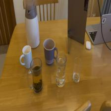
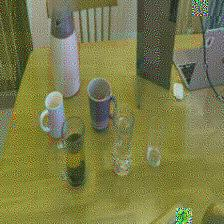
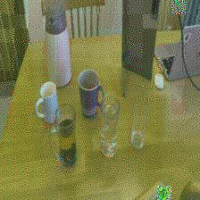
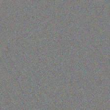
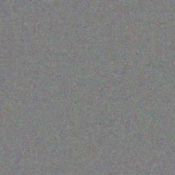

# ViT Privacy: Laplace Noise Injection for Local Differential Privacy

Inject Laplace noise at specified ViT (Vision Transformer) layers for local differential privacy (Local-DP), and evaluate:
1. **CIFAR-100 classification accuracy** — utility preservation under noise
2. **Feature inversion** — reconstruction quality comparison (clean vs. noisy features)

## Requirements

- Python 3.10+
- PyTorch, torchvision
- timm
- PIL, tqdm

```bash
pip install torch torchvision timm pillow tqdm
```

## Project Structure

```
privacy/
├── main.py          # Train ViT on CIFAR-100 (freeze backbone, train classifier)
├── DP.py            # Laplace noise injection + accuracy & inversion evaluation
├── optimization.py  # Feature inversion from ViT intermediate layers
├── images/          # Sample visualizations for README
├── scripts/
│   ├── run_dp.sh    # Run DP experiments
│   └── run_opt.sh   # Run feature inversion only
└── results/         # Output (accuracy CSV, inversion CSV, summary.json, images)
```

## Quick Start

### 1. Train ViT on CIFAR-100

```bash
python main.py
```

This saves `vit_cifar100_best.pt` (best checkpoint by test accuracy).

### 2. Run DP Experiments

```bash
python DP.py \
    --ckpt vit_cifar100_best.pt \
    --stages 1,2,3,4,8,12 \
    --laplace-scale 0.02 \
    --run-acc \
    --run-inversion \
    --image test.jpg \
    --output-dir results/dp_laplace
```

Or use the script (update `--image` path in `scripts/run_dp.sh` if needed):

```bash
cd scripts && bash run_dp.sh
```

### 3. Run Feature Inversion Only (no DP)

```bash
python optimization.py --image test.jpg --stages 1,2,3,4,8,last
```

## Results

Experiments use **ViT-Base/16** on CIFAR-100, with Laplace noise (`scale=0.02`) injected after specified blocks.

### Visualization: Feature Inversion (Clean vs. Laplace)

**Input image (224×224)**



**Layer 1 (shallow)** — Clean vs. Laplace-noisy features

| Clean | Laplace |
|:-----:|:-------:|
|  |  |

**Layer 12 (deep)** — Laplace noise degrades reconstruction quality

| Clean | Laplace |
|:-----:|:-------:|
|  |  |

*Laplace noise at deeper layers increases inversion loss, suggesting privacy gain against reconstruction attacks.*

### 1. Classification Accuracy (CIFAR-100)

| Layer   | Laplace Scale | Accuracy (%) |
|---------|---------------|--------------|
| baseline| 0.0           | **82.60**    |
| 1       | 0.02          | 82.70        |
| 2       | 0.02          | 82.59        |
| 3       | 0.02          | 82.57        |
| 4       | 0.02          | 82.49        |
| 8       | 0.02          | 82.53        |
| 12      | 0.02          | 82.58        |

**Finding:** Accuracy remains stable (~82.5–82.7%) across all layers with Laplace(0.02), indicating good utility preservation under local-DP noise.

### 2. Feature Inversion (Reconstruction Quality)

| Layer | PSNR (clean) | PSNR (Laplace) | Inv Loss (clean) | Inv Loss (Laplace) |
|-------|--------------|----------------|------------------|--------------------|
| 1     | 17.79        | 17.69          | 0.167            | 0.171              |
| 2     | 15.65        | 15.51          | 0.580            | 0.591              |
| 3     | 13.64        | 13.67          | 0.908            | 0.865              |
| 4     | 12.95        | 13.08          | 1.294            | 1.271              |
| 8     | 13.01        | 12.94          | 0.494            | 0.545              |
| 12    | 12.94        | 12.93          | 1.812            | 2.289              |

**Finding:** PSNR is similar for clean vs. Laplace-noisy features across layers. At deeper layers (e.g., 12), inversion loss increases for noisy features, suggesting some privacy gain against reconstruction attacks.

## Output Files

- `results/dp_laplace/accuracy_by_layer.csv` — accuracy per layer
- `results/dp_laplace/inversion_by_layer.csv` — inversion metrics (MSE, PSNR, loss)
- `results/dp_laplace/summary.json` — full experiment summary
- `results/dp_laplace/layer{N}_clean.jpg`, `layer{N}_laplace.jpg` — reconstructed images

## License

MIT
